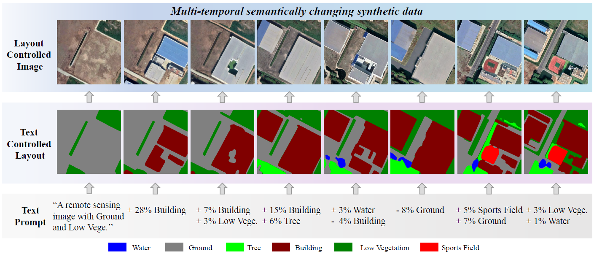
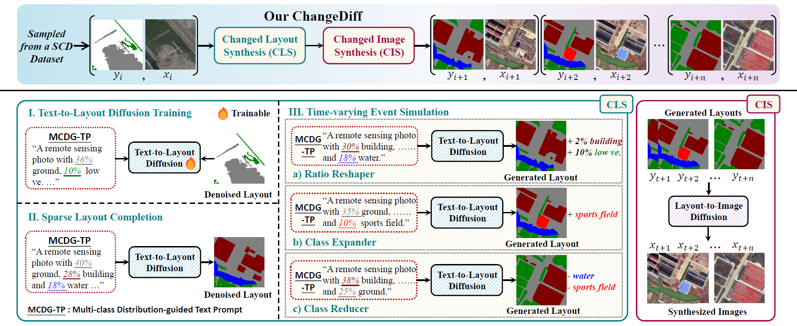

# ChangeDiff
(AAAI-2025) ChangeDiff: A Multi-Temporal Change Detection Data Generator with Flexible Text Prompts via Diffusion Model

This is a [pytorch](http://pytorch.org/) implementation of [ChangeDiff](https://github.com/DZhaoXd/ChangeDiff).
(AAAI-2025 paper)

## :speech_balloon:  Multi-temporal semantic change synthetic data
It is trained on the sparsely labeled semantic change detection SECOND (Yang et al. 2021) dataset.

## :speech_balloon: ChangeDiff Pipeline

