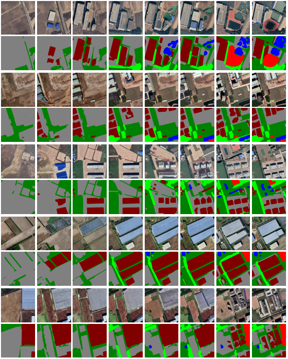

# ChangeDiff
(AAAI-2025) ChangeDiff: A Multi-Temporal Change Detection Data Generator with Flexible Text Prompts via Diffusion Model


This is a [pytorch](http://pytorch.org/) implementation of our paper [ChangeDiff](https://arxiv.org/pdf/2412.15541).
(AAAI-2025)


## :speech_balloon:  Multi-temporal semantic change synthetic data
It is trained on the sparsely labeled semantic change detection SECOND (Yang et al. 2021) dataset.

More sampled synthetic images are available:


## :speech_balloon: ChangeDiff Pipeline


## :speech_balloon: ChangeDiff Training, sampling.
Please find the corresponding training, sampling and testing scripts under the corresponding files.


## Environment Setup

Please follow the below steps:

```bash
conda create -n ChangeDiff python=3.8.5
conda activate ChangeDiff
conda install pytorch==1.13.1 torchvision==0.14.1 torchaudio==0.13.1 pytorch-cuda=11.7 -c pytorch -c nvidia
pip install -r requirements.txt
```

## Dataset Setup

If you want to use your own data, please refer to [preprocess_data](preprocess_data/readme.md) for details.

### 1. Setup the Second Data dataset

```bash
cd train/data
# download Second dataset
# 
```
Form the second label as follows
```
train/data/
    label1/
    label2/
```
Run the preprocessing code:
```
python preprocess_data/merge_label.py
python preprocess_data/split.py
```
After this,  The users should from the following train/data directory:
```
train/data/
    coco_gsam_img/
        train/
			metadata.jsonl
            000000000142.jpg
            000000000370.jpg
            ...
    second_layout/
        label1_00001/
            mask_label1_00001_ground.png
            mask_label1_00001_low vegetation.png
            ...
        label1_00011/
            mask_label1_00011_building.png
            mask_label1_00011_ground.png
			mask_label1_00011_tree.png
            ...
        ...
```
## Training 
To run T2L, use the following command:

```bash
cd train
bash run.sh
```

The results will be saved under `train/results` directory.

## Sample layout from text 
To sample continuous layouts using T2L, use the following command:

```bash
cd infer
bash run_rs.sh
```

The results will be saved under `train/results` directory.


## License
This repository is released under the [Apache 2.0](LICENSE) license. 


### Acknowledge
Some codes are adapted from [FreestyleNet](https://github.com/essunny310/FreestyleNet),  [TokenCompose](https://github.com/mlpc-ucsd/TokenCompose) and [A2Net](https://github.com/guanyuezhen/A2Net). We thank them for their excellent projects.


### Citation
If you find this code useful please consider citing
```
@misc{zang2024ChangeDiff,
      title={ChangeDiff: A Multi-Temporal Change Detection Data Generator with Flexible Text Prompts via Diffusion Model}, 
      author={Qi Zang and Jiayi Yang and Shuang Wang and Dong Zhao and Wenjun Yi and Zhun Zhong},
      year={2024},
      eprint={2412.15541},
      archivePrefix={arXiv},
      primaryClass={cs.CV},
      url={https://arxiv.org/abs/2412.15541}, 
}
```


